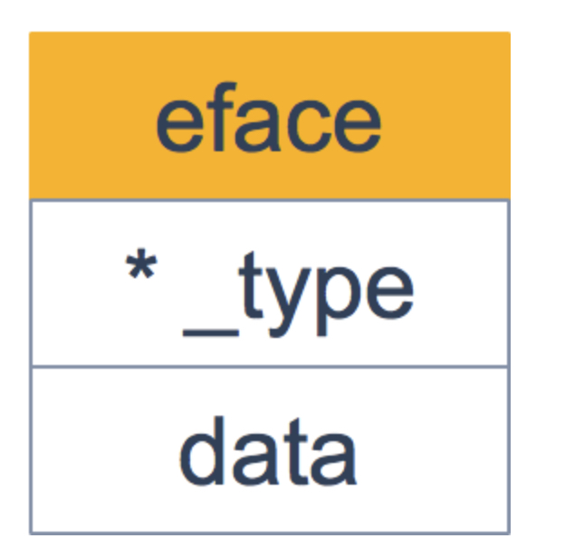
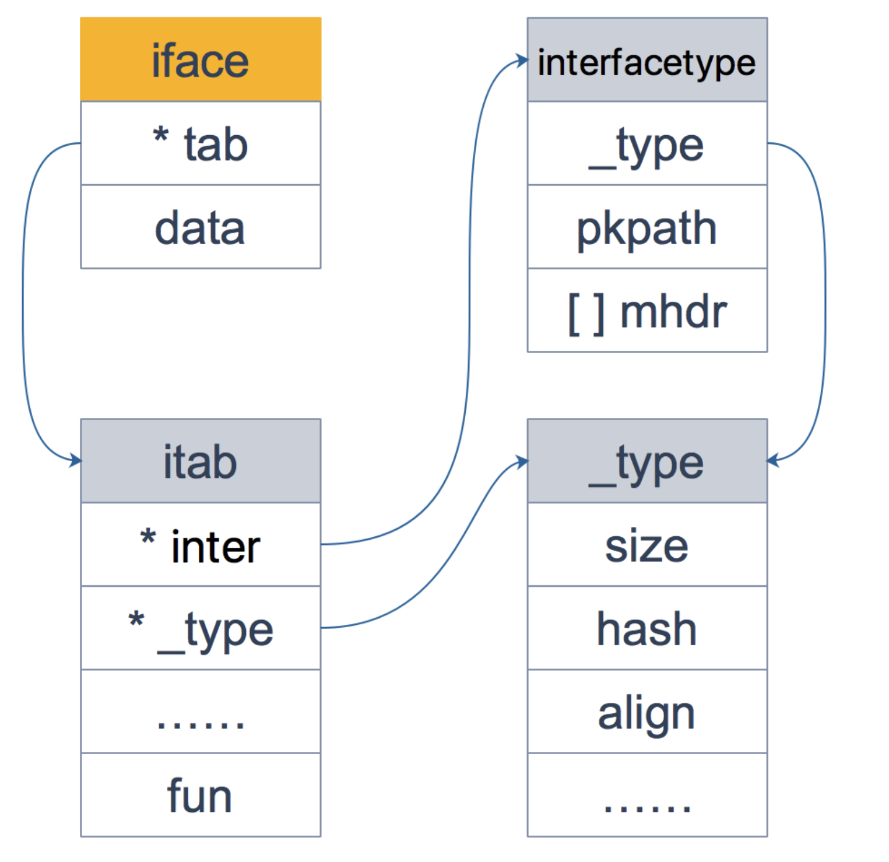

# eface和iface
## 定义
iface 和 eface 都是 Go 中描述接口的底层结构体，区别在于 iface 描述的接口包含方法，而 eface 则是不包含任何方法的空接口：interface{}。
```go
type eface struct {
    _type *_type
    data  unsafe.Pointer
}
```


```go
type iface struct {
	tab  *itab
	data unsafe.Pointer
}

type itab struct {
	inter  *interfacetype
	_type  *_type
	link   *itab
	hash   uint32 // copy of _type.hash. Used for type switches.
	bad    bool   // type does not implement interface
	inhash bool   // has this itab been added to hash?
	unused [2]byte
	fun    [1]uintptr // variable sized
}
```



[参考链接](https://golang.design/go-questions/interface/iface-eface/)